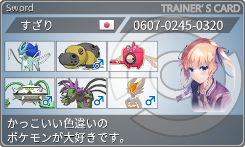

 

# 誰？
- suis です (▽o▽ゞ
- 学生プログラマ

 

# 具体的にどんな人？
2019年からプログラミング勉強始めました。suis です。  
プログラミング経験くらい。学校はドワンゴが提携している N高等学校。  
趣味はもちろんプログラミング。他にはコンシューマーゲーム、アニメ、散歩も一応（？）

 

# ふぇいばりっと
* 音楽（基本ヨルシカしか聴きません）
  * 爆弾魔
  * 神様のダンス
  * レプリカント
  * 思想犯
  * 老人と海
<dl>
  <dt>下記の「言って。」「春泥棒」是非聞いてみて下さい！</dt>
</dl>
<iframe width="560" height="315" src="https://www.youtube.com/embed/F64yFFnZfkI" frameborder="0" allow="accelerometer; autoplay; clipboard-write; encrypted-media; gyroscope; picture-in-picture" allowfullscreen></iframe>
 
<iframe width="560" height="315" src="https://www.youtube.com/embed/Sw1Flgub9s8" title="YouTube video player" frameborder="0" allow="accelerometer; autoplay; clipboard-write; encrypted-media; gyroscope; picture-in-picture" allowfullscreen></iframe>

 

* ゲーム  
  スマッシュブラザーズ、モンスターハンター、ゼノブレイド、ポケモン

 

 

* アニメ
  * いっぱい見ます！

 
  
# Skills
- Windows, Linux
- JavaScript, node.js（Express, Webpack）
- Git, GitHub, Heroku, circleCI, PostgreSQL

 

# Works
* [後出しじゃんけんゲーム](https://suissan.github.io/proCon2020/laterRock-paper-scissors.html)
* [えくすたーなるとぅいったー](https://morning-reaches-66777.herokuapp.com/)
* [半自動IOくん](https://fast-savannah-21150.herokuapp.com/)
* [予定調整（学校の教材で作成したものです）](https://hidden-island-26044.herokuapp.com/)

 

# Contact
- Gmail： s.yukai1567@gmail.com
- [Twitter](https://mobile.twitter.com/szk0245)  
 
<a class="twitter-timeline" data-width="500" data-height="500" data-theme="dark" href="https://twitter.com/szk0245?ref_src=twsrc%5Etfw">Tweets by szk0245</a> 

 

# History
- 2019年 角川ドワンゴ学園 [N高等学校](https://nnn.ed.jp/) 入学
- 2019年 2020年 プログラミングコンテスト健闘賞
- 2020年 プログラミングコンテスト認定証
- 2021年 都合により継続困難
